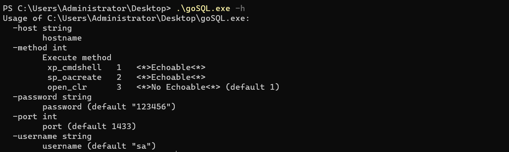
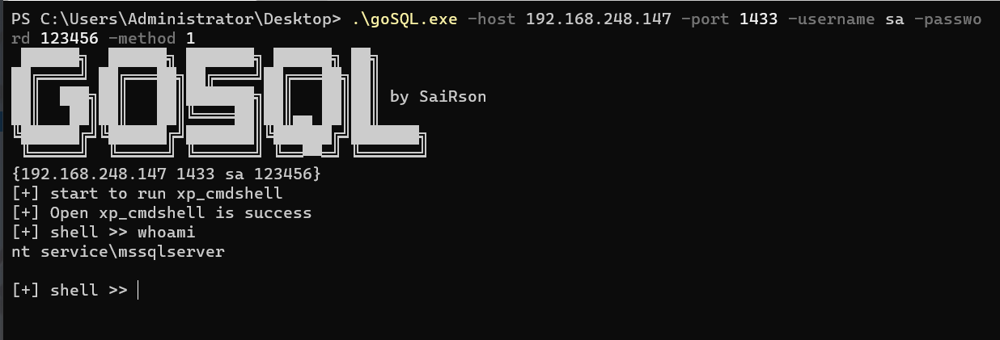
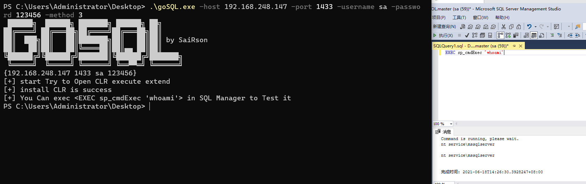
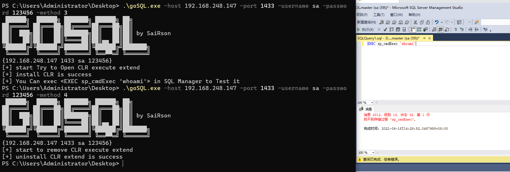

# MSSQL auxiliary lifting tool

Introduction: <br>
This is the product of my learning sql server lifting, I think command execution is too complex, and in the sp_oacreate execution of echo problems, I also solved, I use temporary tables to store echo and use select statements for echo output, in the clR component, I can not perform sql server message acquisition, so I did not clr this branch of the command-line design
<br>

Simple compilation

``
go build main.go
``


介绍:
<br>
这是我在学习sql server 提权时制造的产物，我觉得命令执行过于复杂，并且在sp_oacreate执行时的回显问题，我也进行了解决，我利用临时表的方式来存储回显并采用select语句进行回显的输出，在执行CLR组件时，我无法将sql server的消息获取，所以我并没有对clr这个分支进行命令行的设计

```
goSQL.exe -h
```


xp_cmdshell <br>

```
goSQL.exe -host 192.168.248.147 -port 1433 -username sa -password 123456 -method 1
```


sp_OAcreate
```
goSQL.exe -host 192.168.248.147 -port 1433 -username sa -password 123456 -method 2
```

install CLR extend
```
goSQL.exe -host 192.168.248.147 -port 1433 -username sa -password 123456 -method 3
```

uninstall CLR extend
```
goSQL.exe -host 192.168.248.147 -port 1433 -username sa -password 123456 -method 4
```

